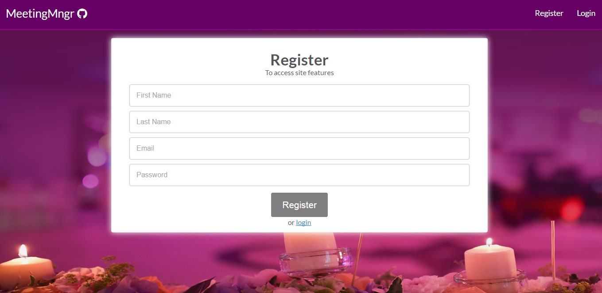
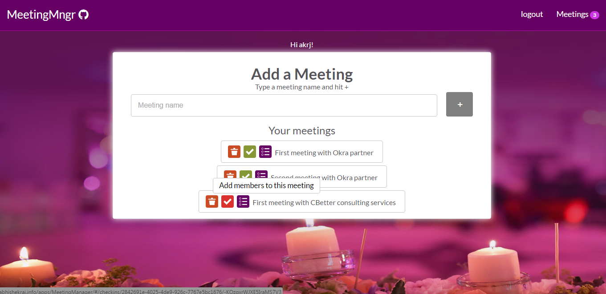
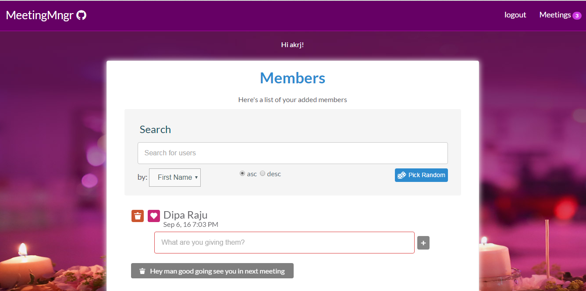
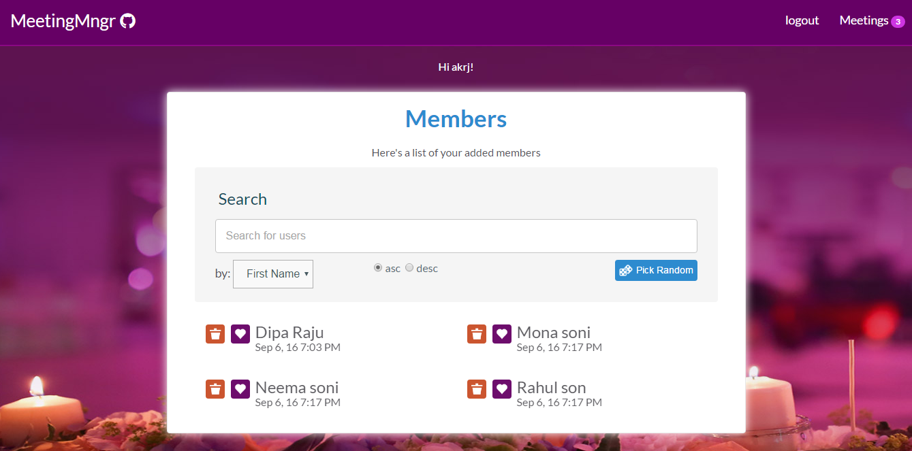

# MeetingManager
This is a real-time web application which help you to manage meetings, take attendance of members at meetup. Add unlimited numbers of members to single or multiple meetings. Responsive UI Design. 
 
 

## Screenshots

## Features
<ul>
<li> Responsive and beautiful UI</li>
<li> Real Time updates</li>
<li> Login and Registration</li>
<li> Create as many meetings as you want</li>
<li> Add unlimited numbers of members to single or multiple meetings.</li>
<li> Searching and filtering</li>
</ul>

## Framework and Tools used:

<ul>
<li> AngularJs</li>
<li> Firebase for database</li>
<li>Gulp for automatic reloading</li>
</ul>

The project was made to demonstrate how to build real time web application using firebase and angularJs skills. It was done as a part of MOOC training session. It might contain some bug. Feel free to fork and enhance some of its feature.

